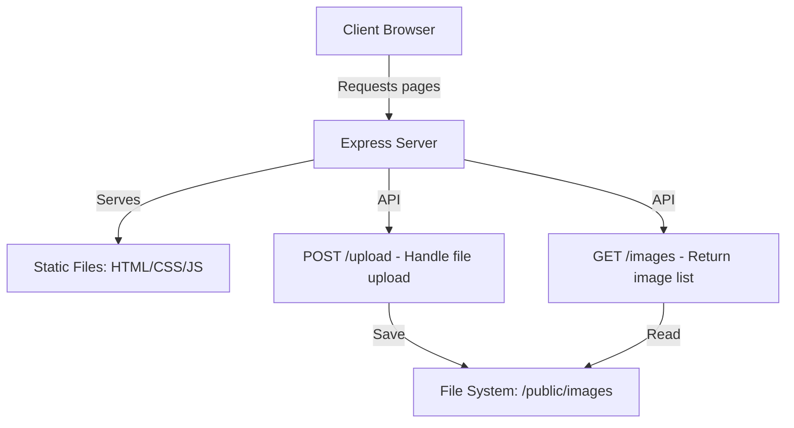

# Photography Portfolio Website Plan

## Overview
Build a photography portfolio website using HTML, CSS, JavaScript frontend with a Node.js Express backend for handling image uploads and serving the portfolio.

## Architecture Diagram

## Todo List
- [ ] Set up project structure with folders for frontend, backend, and public assets
- [ ] Initialize Node.js project with package.json and install dependencies (Express, multer for uploads)
- [ ] Create Express server with routes for serving static files, getting image list, and handling uploads
- [ ] Design and create HTML pages: main portfolio gallery page and upload page
- [ ] Style the website with CSS for responsive gallery layout and upload form
- [ ] Add JavaScript for interactive features like image lightbox and form validation
- [ ] Implement image storage and retrieval logic on the backend
- [ ] Test the website locally: upload images and verify display in gallery

## Key Features
- Gallery view of uploaded photos
- Upload form for adding new pictures
- Responsive design
- Simple backend for file handling